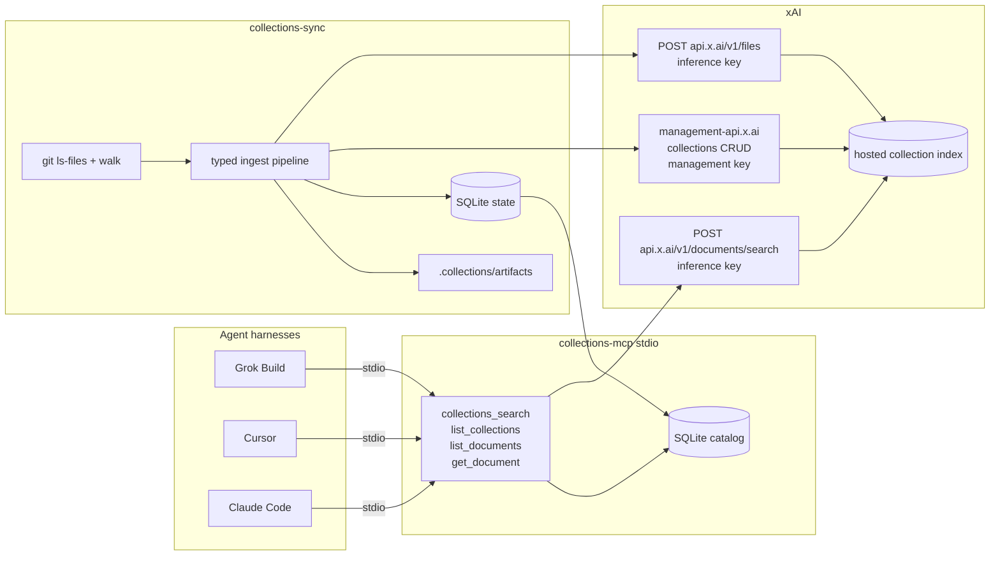
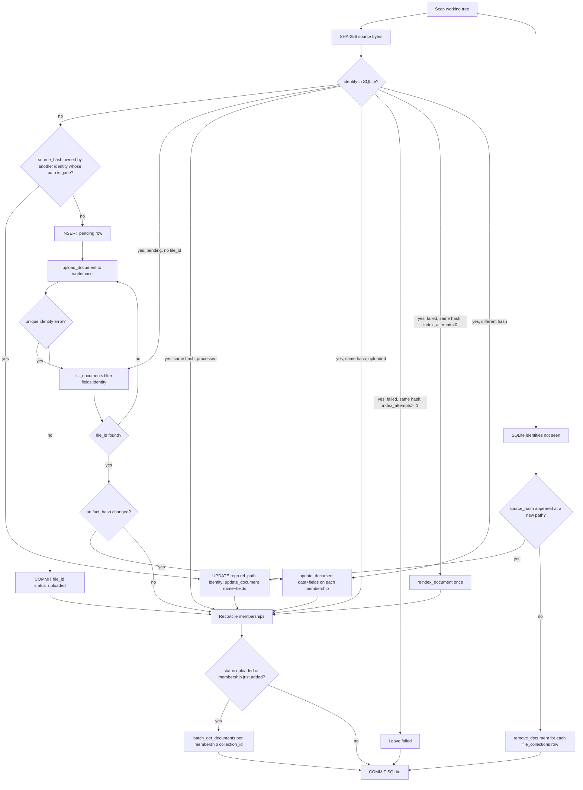
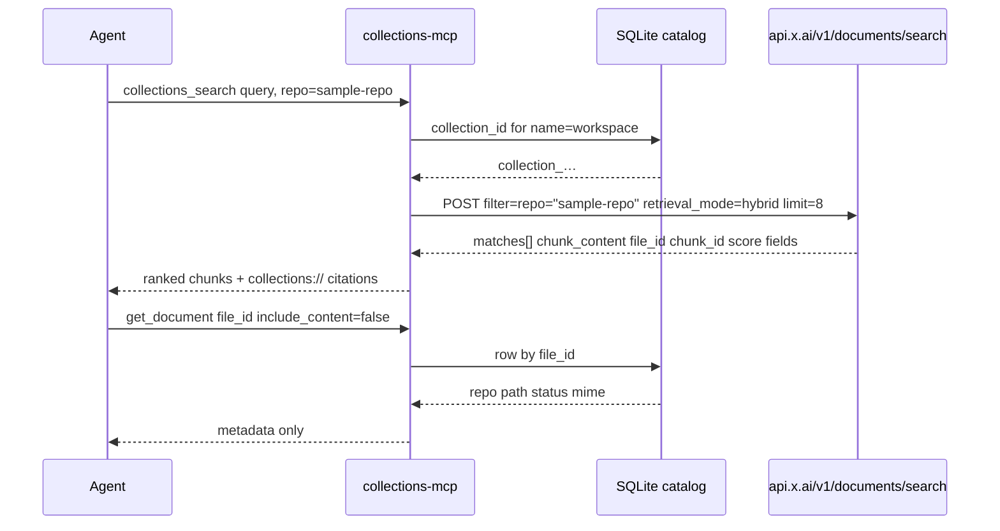
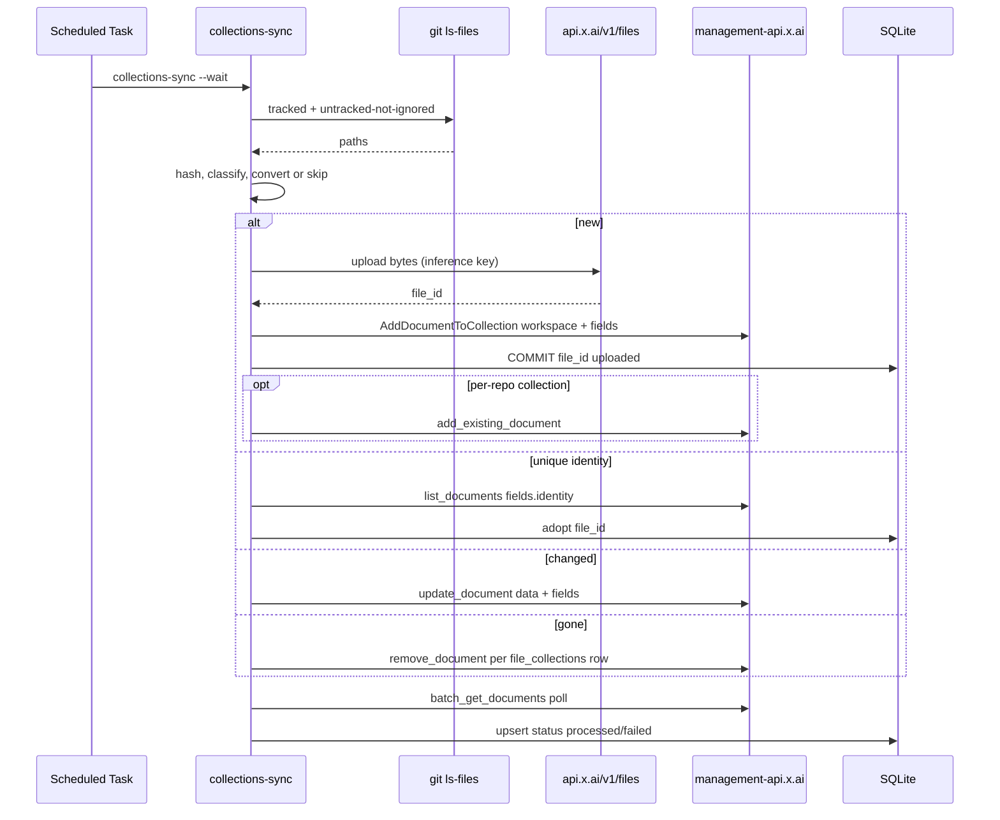

# Workspace Collections MCP

| Field | Value |
| --- | --- |
| Title | Workspace Collections MCP |
| Author | Grok (design-doc-writer) |
| Date | 2026-09-10 |
| Status | Draft |
| Repo | `wayneadams/collections-mcp` (greenfield) |

## Overview

Grok Build's built-in repo search is lexical and structural (grep, filesystem, code graph). Session memory, when enabled, is hybrid FTS5 BM25 plus sqlite-vec over `~/.grok/memory/`. Neither indexes Wayne's durable prose across the workspace — READMEs, AGENTS.md, design docs, RFCs, runbooks, PDFs, office files — as a persistent semantic store.

This design adds a small search-only MCP server plus an offline ingest job that uses the xAI Collections API as hosted RAG. The MCP talks to `POST https://api.x.ai/v1/documents/search` with the inference API key. The sync job talks to `https://management-api.x.ai` with the management API key. Agents in Grok Build, Cursor, and Claude Code search ranked chunks; they never create, upload, or delete collections.

File-type coverage is a typed ingest pipeline, not an infinite converter zoo. Anything Collections already parses is uploaded with the correct MIME. A short list of named Windows-viable converters runs only where the output is useful RAG text. Everything else is skipped with a log line.

## Background & Motivation

The workspace is a parent directory of many child repos: trading systems, content businesses, local apps, data dumps. Agents already grep source. They do not have a durable, cross-repo semantic index of the documents that actually explain how those systems work.

xAI Collections is hosted RAG: upload files, xAI parses/chunks/embeds, search via hybrid/keyword/semantic. Verified against [Collections](https://docs.x.ai/developers/files/collections), [Collections API](https://docs.x.ai/developers/files/collections/api), [Collections Search Tool](https://docs.x.ai/developers/tools/collections-search), [Collections REST search](https://docs.x.ai/developers/rest-api-reference/collections/search), [Pricing](https://docs.x.ai/developers/pricing), [Security FAQ](https://docs.x.ai/developers/faq/security), the [Collections API launch post](https://x.ai/blog/grok-collections-api), and `xai-sdk` `src/xai_sdk/sync/collections.py` plus `src/xai_sdk/collections.py` on `github.com/xai-org/xai-sdk-python`.

Facts used as design truth:

- Max file size for Collections: 100MB. Credits are required to upload.
- Any UTF-8 text is accepted. A non-exhaustive MIME list gets special conversion/chunking (quoted in the File-type coverage section).
- Auth is split. Management key at `https://management-api.x.ai` for create/list/update/upload/delete. Inference key at `https://api.x.ai` for `POST /v1/documents/search`. File bytes upload to `https://api.x.ai/v1/files` with the inference key, then `AddDocumentToCollection` uses the management key.
- Default retrieval is hybrid. Metadata filters use AIP-160. Embedding model example: `grok-embedding-small`. Chunking example: `max_chunk_size_tokens: 1024`, `chunk_overlap_tokens: 200`, `encoding_name: o200k_base`.
- A file can belong to multiple collections.
- Documents live on xAI servers. "We do not use user data stored on Collections for model training purposes" ([Collections](https://docs.x.ai/developers/files/collections)); the launch post adds "unless the user has given consent." Zero Data Retention is incompatible with Collections. Default API request/response traffic is kept 30 days for abuse/audit. Collection files persist until deleted and are billed as storage. xAI claims SOC 2 Type 2. HIPAA needs a BAA. No public CMEK, residency, or on-prem.
- Pricing (USD, [Pricing](https://docs.x.ai/developers/pricing)): file storage $0.025/GiB/day, collection (indexed) storage $0.10/GiB/day, collection downloads $0.20/GiB, Collections Search $2.50/1k calls. Direct `POST /v1/documents/search` is that retrieval product. Grok Build billing a Remote MCP tool call is token-based; the MCP's HTTP search is a separate $2.50/1k line.
- Chat file attachments are a different product (48MB cap, `attachment_search` at $10/1k). This design does not use them.

Nothing in the workspace today wraps Collections as MCP. This is greenfield.

Grok Build MCP wiring is stdio (or HTTP/SSE) in `~/.grok/config.toml` under `[mcp_servers.<name>]`, documented in the Grok Build user guide under MCP servers. Tool discovery is BM25 over tool names and descriptions via `search_tool`, then `use_tool` with a qualified name `server__tool`. Default MCP result cap is 20_000 bytes (`GROK_MAX_MCP_OUTPUT_BYTES`). A small tool surface beats dumping every REST route.

## Goals & Non-Goals

### Goals

- Give Grok Build, Cursor, and Claude Code the same four search/list/get tools over a persistent hosted index of Wayne's files.
- Maximize feasible file-type coverage into Collections: native pass-through for the official special-MIME list and UTF-8 text, plus a named, Windows-viable convert-then-upload set behind flags.
- Keep the management key off the agent process. Inference key on the MCP. Management key on `collections-sync`.
- Incremental sync from git-tracked and gitignored-excluded untracked files. SHA-256 identity. Skip unchanged. Update on change. Remove on delete. Rename by hash match.
- Docs-heavy default allowlist (prose/office/PDF/HTML/YAML) so the first sync is useful RAG rather than a dump of `node_modules`, parquet, or a child repo's `experiments` JSON.

### Non-Goals

- Replacing grep for source code navigation. Source is opt-in.
- A local embeddings RAG (sqlite-vec, Chroma, LanceDB).
- Hanging `collections.create` / `upload_document` / `delete` off the MCP.
- HTTP/SSE MCP transport in the first implementation. stdio is the default for all three harnesses on this box.
- Splitting files larger than 100MB. They are skipped.
- Kitchen-sink converters with no named library, or converters that need a GPU by default.
- CMEK, residency, on-prem, or ZDR compatibility. Collections cannot run under ZDR.
- Syncing on every agent keystroke.

## Key Decisions

1. **Two processes, two keys.** `collections-mcp` is search-only and holds `XAI_API_KEY`. `collections-sync` is ingest and holds the management key plus the inference key (file upload hits `api.x.ai/v1/files`). Sync always constructs `xai_sdk.Client(api_key=..., management_api_key=...)` from the YAML fields `xai_api_key` and `xai_management_api_key`; it does not rely on getenv. The SDK fallback in `xai_sdk/sync/client.py` is `os.getenv("XAI_MANAGEMENT_KEY")` (not `XAI_MANAGEMENT_API_KEY`) when the kwarg is omitted. `server.py` never constructs `xai_sdk.Client` (REST search via `httpx` only) and must not have `XAI_MANAGEMENT_KEY` or `XAI_MANAGEMENT_API_KEY` in the harness `env` block. An agent with a management key can upload the workspace, including secrets, and can delete the index. That key stays on the scheduled job.
2. **Search goes through REST, not `client.collections.search()`.** The Python SDK `Client.collections.search` in `xai_sdk/sync/collections.py` accepts `query`, `collection_ids`, `limit`, `instructions`, `retrieval_mode`. The gRPC `SearchRequest` in `documents_pb2` has no `filter` field. `POST https://api.x.ai/v1/documents/search` does: AIP-160 `filter`, `fields` on each match, `page_number`. The MCP needs those. Management calls (create, upload, update, delete, list, get, batch_get, wait-for-index) use the SDK.
3. **List/get on the MCP read local SQLite, not the Management API.** `list_collections` / `list_documents` / `get_document` metadata are management endpoints. Serving them from the sync job's catalog keeps the management key off the harness. `get_document` content reads the local workspace file (or a cached conversion artifact), not `GET /v1/files/{id}/content` ($0.20/GiB).
4. **One workspace collection by default.** Metadata fields `repo` and `path` are `inject_into_chunk: true`, so retrieval already distinguishes projects. Per-repo collections are opt-in via `repos.<name>.collection`. Every sync, after the hash decision, reconciles memberships (desired = workspace plus `repos.<name>.collection` when set): missing `file_collections` rows call `add_existing_document`; extra rows call `remove_document`. First upload still goes to workspace then extra collections. Search `collection` looks up `collections.name`. A file in two collections is one Files object added twice; do not assume that is free on the $0.10/GiB/day index line.
5. **Docs default-on; source, structured data, OCR, audio, parquet opt-in.** Default `include` is prose/office/PDF/HTML. JSON/CSV/TSV/XML/ipynb/xlsx sit behind `include_structured_data: false`. Source sits behind `include_source: false`. When a converter flag is true, that class's extensions are unioned into the candidate set even if they are absent from `include` (so `converters.archives: true` actually sees `*.zip`).
6. **Skip files over 100MB. Do not split.** Collections rejects above 100MB. Splitting a PDF or office file locally throws away layout-aware parsing. Splitting text makes citation identity messy (`path` vs `path-part-2`). Log and skip. Revisit only for UTF-8 text if a real file needs it.
7. **Default trigger is a Windows Scheduled Task, not a post-commit hook.** The working tree is what agents read. Dirty files should be in the index. A scheduled `collections-sync` hashes the working tree (git ls-files plus untracked-not-ignored). Post-commit and CI on default branch are optional extras.
8. **Python 3.12, stdio MCP, official `mcp` SDK pinned `>=1.17,<2` (FastMCP), `xai-sdk`, `httpx`.** `pip install mcp` currently resolves to 2.x (`MCPServer`). Cursor and Claude Code examples still target the 1.x FastMCP stdio shape. Pin `<2` until those hosts are verified on v2. Transport is stdio because Grok Build, Cursor, and Claude Code all spawn a local process.
9. **Hybrid retrieval, default limit 8, 1500-character chunks, payload budget 18_000 bytes.** Grok Build truncates MCP results at 20_000 bytes. The MCP serializes at most 18_000 bytes of JSON (2_000 left for the envelope). `chunk_chars_effective = min(chunk_chars, max(200, (18000 // limit) - 500))`. If the payload is still over budget, drop lowest-score matches and set `truncated: true`. `limit` max remains 20 for Cursor/Claude; the budget applies on every host.
10. **New repo `collections-mcp`, one package, two console scripts.** Not a subfolder of an existing project. Nothing in the workspace already does this. Public GitHub: `wayneadams/collections-mcp`, MIT. The package name on PyPI is `collections-mcp` so `uvx collections-mcp` starts the MCP and `uvx --from collections-mcp collections-sync` (or a `collections-sync` console script in the same wheel) starts ingest.
11. **Public install is `uvx` plus `env`, not clone-then-absolute-python.exe.** Official Python MCP servers and Serena launch with `uvx`. Playwright/GitHub/Context7 lead the README with one copy-paste `mcpServers` JSON, then per-client blocks including `grok mcp add`. Keys live in harness `env` (and in a gitignored `collections.yaml` for sync). The README's first block is that JSON. An absolute `python.exe` path is the from-source and Scheduled Task path on the operator machine, not the public default. Until PyPI exists, the README uses `uvx --from git+https://github.com/wayneadams/collections-mcp`.

## Proposed Design

### Product shape

The package lives in this repository.

One Python package `collections_mcp`, two entry points:

| Script | Module | Key | Role |
| --- | --- | --- | --- |
| `collections-mcp` | `collections_mcp.server` | `XAI_API_KEY` | stdio MCP, search/list/get |
| `collections-sync` | `collections_mcp.sync` | YAML `xai_api_key` + `xai_management_api_key` passed as Client kwargs | discover, convert, upload, update, delete |

```
collections-mcp/
  pyproject.toml
  README.md
  AGENTS.md
  src/collections_mcp/
    __init__.py
    server.py          # FastMCP stdio
    sync.py            # CLI: see the CLI flags table
    # scripts/run-sync.ps1  # Scheduled Task wrapper (full python.exe, Set-Location)
    manifest.py        # load collections.yaml
    state.py           # SQLite
    discover.py        # git ls-files / walk
    mime.py            # extension + MIME map
    pipeline.py        # classify → convert or skip → upload
    search_client.py   # REST POST /v1/documents/search
    mgmt_client.py     # xai-sdk collections.*
    converters/
      archive.py       # zipfile, tarfile
      ocr.py           # rapidocr-onnxruntime (extra)
      audio.py         # xAI speech-to-text REST (extra)
      parquet.py       # pyarrow schema+sample (extra)
  skills/collections-search/SKILL.md
  tests/
```

`pyproject.toml` extras: `[ocr]`, `[audio]`, `[parquet]`. Core install is `mcp`, `xai-sdk`, `httpx`, `pyyaml`, `charset-normalizer`, `puremagic`.

Console scripts:

```toml
[project.scripts]
collections-mcp = "collections_mcp.server:main"
collections-sync = "collections_mcp.sync:main"
```

### Runtime topology



The MCP process never imports `mgmt_client.py` and never constructs `xai_sdk.Client`. Search is `httpx` against `api.x.ai`. If `XAI_MANAGEMENT_KEY` or `XAI_MANAGEMENT_API_KEY` is in the process environment, `server.py` ignores both. Harness `env` blocks list only `XAI_API_KEY` and `COLLECTIONS_MANIFEST`.

### Collection configuration

Created once by `collections-sync` via `client.collections.create`:

```python
collection = client.collections.create(
    name="workspace",
    model_name="grok-embedding-small",
    description="Workspace documents",
    chunk_configuration={
        "tokens_configuration": {
            "max_chunk_size_tokens": 1024,
            "chunk_overlap_tokens": 200,
            "encoding_name": "o200k_base",
        },
        "strip_whitespace": True,
        "inject_name_into_chunks": True,
    },
    metric_space="cosine",
    field_definitions=[
        {"key": "identity", "required": True, "unique": True, "inject_into_chunk": False, "description": "repo/posix-relpath"},
        {"key": "repo", "required": True, "unique": False, "inject_into_chunk": True, "description": "workspace child repo name"},
        {"key": "path", "required": True, "unique": False, "inject_into_chunk": True, "description": "posix path relative to repo root"},
        {"key": "content_hash", "required": True, "unique": False, "inject_into_chunk": False, "description": "sha256 of uploaded bytes"},
        {"key": "git_sha", "required": False, "unique": False, "inject_into_chunk": False, "description": "HEAD at sync time"},
        {"key": "converter", "required": True, "unique": False, "inject_into_chunk": False, "description": "native|unzip-member|ocr|stt|parquet-preview"},
        {"key": "original_mime", "required": True, "unique": False, "inject_into_chunk": False, "description": "detected source MIME"},
        {"key": "uploaded_mime", "required": True, "unique": False, "inject_into_chunk": False, "description": "MIME of bytes sent to Files API"},
    ],
)
```

`identity` is unique so a retry cannot insert a duplicate `(repo, path)`. That uniqueness is also the crash-recovery key: if SQLite never recorded a `file_id` after Collections accepted the document, the next `upload_document` hits the unique constraint. Recovery is specified in the Incremental algorithm section. `content_hash` is not unique: copies across repos are allowed. `repo` and `path` are injected into every chunk so hybrid search can filter conceptually ("sample-repo runbook") even without an AIP-160 filter. Directory scope uses exact `path=` / `identity=` or a `repo=` filter, not AIP-160 prefix matching (Collections documents that wildcards are unsupported).

SDK `fields` is `dict[str, str]`. All values are strings.

### Manifest

Path: `collections.yaml` at the workspace root, or whatever `COLLECTIONS_MANIFEST` points at.

```yaml
workspace_root: /path/to/workspace
state_db: /path/to/workspace/.collections/state.db
artifact_dir: /path/to/workspace/.collections/artifacts

xai_api_key: ""          # inference key, local file only
xai_management_api_key: ""  # management key, sync only

collection:
  name: workspace
  model_name: grok-embedding-small

include_source: false
include_structured_data: false   # json/csv/tsv/xml/ipynb/xls/xlsx/xlsm
converters:
  archives: true          # unpack zip/tar/tgz; union archive extensions into the candidate set
  ocr: false              # rapidocr-onnxruntime; unions image extensions
  audio: false            # xAI speech-to-text REST; unions audio extensions
  parquet: false          # pyarrow schema + sample rows as markdown; unions *.parquet
  video_audio: false      # ffmpeg extract + audio converter; implies converters.audio; unions video extensions

search:
  retrieval_mode: hybrid
  default_limit: 8
  max_limit: 20
  chunk_chars: 1500
  payload_budget_bytes: 18000

sync:
  upload_concurrency: 4
  index_poll_interval_s: 10
  index_timeout_s: 600
  max_file_bytes: 104857600
  archive_max_members: 500
  archive_max_uncompressed_bytes: 104857600

include:
  - "**/*.md"
  - "**/*.mdx"
  - "**/*.rst"
  - "**/*.txt"
  - "**/*.rtf"
  - "**/*.pdf"
  - "**/*.doc"
  - "**/*.docx"
  - "**/*.odt"
  - "**/*.epub"
  - "**/*.tex"
  - "**/*.latex"
  - "**/*.html"
  - "**/*.htm"
  - "**/*.xhtml"
  - "**/*.yaml"
  - "**/*.yml"
  - "**/*.ppt"
  - "**/*.pptx"

# Used only when include_structured_data: true
structured_include:
  - "**/*.json"
  - "**/*.csv"
  - "**/*.tsv"
  - "**/*.xml"
  - "**/*.ipynb"
  - "**/*.xls"
  - "**/*.xlsx"
  - "**/*.xlsm"

# Used only when include_source: true
source_include:
  - "**/*.py"
  - "**/*.pyi"
  - "**/*.js"
  - "**/*.jsx"
  - "**/*.ts"
  - "**/*.tsx"
  - "**/*.mjs"
  - "**/*.cjs"
  - "**/*.go"
  - "**/*.rs"
  - "**/*.java"
  - "**/*.kt"
  - "**/*.kts"
  - "**/*.c"
  - "**/*.h"
  - "**/*.cc"
  - "**/*.cpp"
  - "**/*.hpp"
  - "**/*.cs"
  - "**/*.php"
  - "**/*.rb"
  - "**/*.swift"
  - "**/*.scala"
  - "**/*.hs"
  - "**/*.erl"
  - "**/*.lua"
  - "**/*.pl"
  - "**/*.pm"
  - "**/*.sql"
  - "**/*.sh"
  - "**/*.bash"
  - "**/*.zsh"
  - "**/*.ps1"
  - "**/*.psm1"
  - "**/*.r"
  - "**/*.Rmd"
  - "**/*.dart"
  - "**/*.css"
  - "**/*.scss"
  - "**/*.sass"
  - "**/*.toml"
  - "**/*.ini"
  - "**/*.cfg"
  - "**/*.properties"

exclude:
  - "**/node_modules/**"
  - "**/.git/**"
  - "**/dist/**"
  - "**/build/**"
  - "**/target/**"
  - "**/.venv/**"
  - "**/venv/**"
  - "**/__pycache__/**"
  - "**/.next/**"
  - "**/coverage/**"
  - "**/experiments/**"
  - "**/*.pyc"
  - "**/package-lock.json"
  - "**/yarn.lock"
  - "**/pnpm-lock.yaml"
  - "**/Cargo.lock"
  - "**/poetry.lock"
  - "**/uv.lock"
  - "**/.env"
  - "**/.env.*"
  - "**/*.pem"
  - "**/*.key"
  - "**/id_rsa"
  - "**/id_ed25519"
  - "**/*.exe"
  - "**/*.dll"
  - "**/*.so"
  - "**/*.dylib"
  - "**/*.wasm"
  - "**/*.class"
  - "**/*.jar"
  - "**/*.whl"
  - "**/SampleData/**"
  - "**/*-data/**"
  - "**/_backups/**"
  - "**/scratch/**"
  - "**/collections.yaml"
  - "**/.collections/**"
  - "**/.cursor/**"
  - "**/.mcp.json"
  - "**/.claude.json"
  - "**/.grok/**"

repos:
  # Optional per-repo collection. Absent means files go only to the workspace collection.
  # sample-repo:
  #   collection: sample-repo
```

Keys live inline in this file on this machine. MCP config in Grok/Cursor/Claude receives only `XAI_API_KEY` (and `COLLECTIONS_MANIFEST`) through the user-level harness `env` block. Do not put either management-key name in harness env. `collections-mcp` loads `collections.yaml` for `workspace_root`, `state_db`, `collection.name`, and search defaults; it does not bind `xai_management_api_key`.

Include globs never apply to the manifest file, `state.db`, `artifact_dir`, or harness MCP JSON. Those paths are hard-skipped as `secret` even if a glob would match. Candidate-set construction (include ∪ flag unions, then exclude, then hard-skip) is in the Discovery section.

### Local SQLite schema

File: `<workspace_root>/.collections/state.db`. WAL mode, `synchronous=NORMAL`.

MCP opens with `mode=ro` and `timeout=5` (seconds). Sync opens read-write with `timeout=30`. On `database is locked` the MCP retries twice (0.2s, 0.8s) then returns `isError: true`. Sync waits out the 30s timeout; it does not kill the MCP.

```sql
CREATE TABLE collections (
  collection_id TEXT PRIMARY KEY,
  name TEXT NOT NULL UNIQUE,
  kind TEXT NOT NULL CHECK (kind IN ('workspace', 'repo')),
  repo TEXT,
  created_at TEXT NOT NULL
);

CREATE TABLE files (
  repo TEXT NOT NULL,
  rel_path TEXT NOT NULL,
  identity TEXT NOT NULL UNIQUE,
  source_hash TEXT NOT NULL,
  artifact_hash TEXT,
  file_id TEXT,
  size_bytes INTEGER,
  original_mime TEXT,
  uploaded_mime TEXT,
  converter TEXT,
  artifact_path TEXT,
  git_sha TEXT,
  status TEXT NOT NULL CHECK (status IN (
    'pending', 'uploaded', 'processed', 'failed', 'skipped', 'deleted'
  )),
  index_attempts INTEGER NOT NULL DEFAULT 0,
  skip_reason TEXT,
  error TEXT,
  mtime_ns INTEGER,
  updated_at TEXT NOT NULL,
  PRIMARY KEY (repo, rel_path)
);

CREATE TABLE file_collections (
  file_id TEXT NOT NULL,
  collection_id TEXT NOT NULL,
  PRIMARY KEY (file_id, collection_id)
);

CREATE TABLE sync_runs (
  id INTEGER PRIMARY KEY,
  started_at TEXT NOT NULL,
  finished_at TEXT,
  files_seen INTEGER,
  uploaded INTEGER,
  updated INTEGER,
  deleted INTEGER,
  skipped INTEGER,
  failed INTEGER,
  bytes_uploaded INTEGER
);

CREATE INDEX idx_files_source_hash ON files(source_hash);
CREATE INDEX idx_files_file_id ON files(file_id);
CREATE INDEX idx_files_status ON files(status);
```

`identity` = `{repo}/{posix_rel_path}`, for example `sample-repo/docs/README.md`. Paths are stored POSIX (`/`) even on Windows. Workspace-root files use synthetic repo `_root`, so `<workspace_root>/README.md` is `_root/README.md`.

Rename updates `files.repo`, `files.rel_path`, and `files.identity` in place (SQLite allows updating PRIMARY KEY columns). `file_collections` is keyed by stable `file_id`, so rename does not touch it.

### Discovery

One walk. Do not `os.walk` the whole workspace as a single tree.

1. List immediate children of `workspace_root` (directories and files).
2. **Skip-dir prune before descent.** If a child directory's name is in `SKIP_DIR_NAMES`, do not enter it. `SKIP_DIR_NAMES` is the set of names from exclude entries of the form `**/Name/**` or `**/Name`, plus `node_modules`, `.git`, `.collections`, `.cursor`, `.grok`. This is how `SampleData`, root `node_modules`, and `.collections` are never walked. `**/SampleData/**` would not match a `rel_path` of `foo.parquet`; matching against `identity` (`SampleData/foo.parquet`) and pruning the directory by name are both required.
3. **Git child** (immediate child contains `.git`): repo name = that directory's name (`sample-repo`, not `sample-repo/common`; nested `.git` is not a separate repo). `git -C <child> ls-files -z` union `git -C <child> ls-files -z --others --exclude-standard`. Working-tree bytes, not HEAD. `git rev-parse HEAD` → `git_sha`. Do not recurse into nested `.git` / submodules as extra roots; `git ls-files` of the outer repo is the path list. Submodule contents are out of scope unless that submodule is itself an immediate child of `workspace_root`.
4. **Non-git child directory** (`notes/`, `transcripts/`, and any other non-git sibling): repo name = directory name. `os.walk` from that child, pruning any dir in `SKIP_DIR_NAMES` before descent. Same include/exclude as git children.
5. **Workspace-root files** (files that sit directly in `workspace_root`, not in a child): synthetic repo `_root`, `rel_path` = the filename. `collections.yaml` lands here and is hard-skipped.
6. **Nested path `sample-repo/common`:** not a git root. Its files are part of repo `sample-repo` via `git ls-files`.

**Glob basis is `identity`**, always `{repo}/{posix_rel_path}`. Include, `source_include`, `structured_include`, converter unions, and exclude all match against `identity`. Examples: `**/*.md` matches `sample-repo/docs/README.md` and `_root/README.md` and `notes/foo.md`. `**/SampleData/**` matches `SampleData/foo.parquet`. `**/experiments/**` matches `sample-repo/experiments/exp_009/bar.md`.

**Candidate set** (order matters):

```
candidates = match(include, identity)
if include_source: candidates |= match(source_include, identity)
if include_structured_data: candidates |= match(structured_include, identity)
if converters.archives: candidates |= match(["**/*.zip", "**/*.tar", "**/*.tgz", "**/*.tar.gz"], identity)
if converters.ocr: candidates |= match(["**/*.png", "**/*.jpg", "**/*.jpeg", "**/*.tif", "**/*.tiff", "**/*.webp", "**/*.gif", "**/*.bmp"], identity)
if converters.audio: candidates |= match(["**/*.mp3", "**/*.wav", "**/*.m4a", "**/*.flac", "**/*.ogg", "**/*.opus"], identity)
if converters.video_audio: candidates |= match(["**/*.mp4", "**/*.mkv", "**/*.mov", "**/*.webm", "**/*.avi"], identity)
if converters.parquet: candidates |= match(["**/*.parquet"], identity)
candidates -= match(exclude, identity)
hard-skip (skip_reason=secret), regardless of include:
  the manifest path
  state_db and everything under artifact_dir / .collections/
  **/.cursor/**
  **/.mcp.json
  **/.claude.json
  **/.grok/**
  any basename collections.yaml
```

Archive members re-enter this same candidate test (so a zip of `.py` files uploads members only if `include_source` is on). `.docx` / `.xlsx` / `.pptx` / `.odt` / `.epub` are classified native by suffix before the archive branch.

### Incremental algorithm



**Membership.** Desired set for a live file is always `{workspace collection}` union `{repos.<repo>.collection}` when that key is set. Ensure each desired collection exists (`kind=repo` collections share the workspace `field_definitions`). After the hash/upload/update/rename decision, reconcile `file_collections` against that set:

- Missing row → `add_existing_document(collection_id, file_id, fields=same)` then INSERT `file_collections`.
- Extra row (manifest membership removed) → `remove_document(collection_id, file_id)` then DELETE the `file_collections` row.
- Matching rows → no membership API call.

This runs for new uploads, processed unchanged files, recovered pending rows, and files whose `repos.<name>.collection` was added after they were already indexed. First bytes still go to workspace via `upload_document`; extra collections never get a second Files upload. Search `collection` looks up `collections.name` → `collection_id` and passes that id in `source.collection_ids`. Default search uses the workspace collection.

**Rules:**

- Hash is SHA-256 of original file bytes (`source_hash`). After conversion, also store `artifact_hash` of uploaded bytes and `artifact_path` when a converter wrote a cache file.
- Unchanged `source_hash` and `status='processed'` → do not re-convert or re-upload bytes. Still run membership reconcile. If reconcile added a membership, that `file_id` goes to the poll batch for the new `collection_id`.
- Unchanged `source_hash` and `status='uploaded'` → membership reconcile, then poll (in-flight index, including runs without `--wait`).
- Changed `source_hash` → `update_document` on the workspace membership with `name`, `data`, `content_type`, `fields`. Then `update_document` on each extra membership with `fields` only (same `file_id`; bytes already replaced). Then membership reconcile.
- Deleted path, no hash match → `remove_document(collection_id, file_id)` for every row in `file_collections` for that `file_id`, then mark `status='deleted'`.
- Rename = same `source_hash`, old path missing, new path unknown → keep `file_id`. SQLite `UPDATE files SET repo=?, rel_path=?, identity=? WHERE file_id=?` (PRIMARY KEY columns change in place). `update_document` on each membership with new `name` and fields (`identity`, `path`, `repo`). No re-upload of bytes. Then membership reconcile.
- New file: `INSERT` a `pending` row (`file_id` NULL) and commit. Then `upload_document(workspace_id, ..., wait_for_indexing=False)`. On success, `UPDATE file_id=?, status='uploaded'` and commit **before** polling. Then membership reconcile.
- **Crash recovery (unique identity):** If `upload_document` / `AddDocumentToCollection` fails because `identity` is unique and already present, or if a row is `pending` with `file_id` NULL at the start of a run, call `list_documents(workspace_id, filter='fields.identity:"{identity}"')`. If a `file_id` is returned, store it, commit, `update_document` if `artifact_hash` differs, then membership reconcile. If the list is empty, continue with `upload_document` (INSERT-pending then crash before upload).
- After a batch of up to 20 uploads/updates/new-memberships, `batch_get_documents` **once per membership `collection_id`** (status is per collection). Poll every 10s (`DEFAULT_INDEXING_POLL_INTERVAL`). Per-batch timeout 600s (SDK default is 120s, too short for large PDFs). Terminal states: `DOCUMENT_STATUS_PROCESSED` or `DOCUMENT_STATUS_FAILED`. In-progress: `PROCESSING`, `CHUNKED`, `EMBEDDING`, `WRITING`. A file is `processed` only when every current membership reports PROCESSED.
- **Failed index:** on `DOCUMENT_STATUS_FAILED` during poll, call `reindex_document` once in that same run and keep polling that `file_id` on that collection. If it is still FAILED, set `status='failed'`, `index_attempts=1`, store `error_message`. Later syncs skip that row while `source_hash` is unchanged. `--reindex` resets `index_attempts` to 0 and reindexes matching rows. A new `source_hash` always takes the update path. The mermaid `index_attempts==0` branch covers a crash after FAILED was recorded but before the in-run reindex ran.
- Partial index is acceptable. MCP search hits whatever Collections has processed.

`client.collections.upload_document` does not take `content_type`. Filename extension on `name` is how the Files API infers MIME. Converted artifacts are named `{original_stem}.ocr.md`, `{original_stem}.stt.md`, `{original_stem}.parquet.md`. Native uploads: `name` is `{repo}__{posix_rel_path with / replaced by __}` truncated to a safe filename, plus original extension.

### Indexing wait policy

| Path | Policy |
| --- | --- |
| MCP | Never waits. Searches the live index. |
| Sync upload | `wait_for_indexing=False`. |
| Sync end of batch | Poll `batch_get_documents`. |
| Sync CLI `--wait` | After the run, poll every remaining `uploaded` row until processed, failed, or `index_timeout_s`. |
| Default scheduled run | `--wait` on, so the catalog `status` column matches the index by the time the job exits. |

### File-type coverage

Feasibility bar. A class is in-scope if and only if:

1. It is UTF-8 text, or it is on the official special-MIME list, or
2. A named library that runs on Windows without a GPU produces UTF-8 text or a special-MIME artifact ≤ 100MB, and that text is useful for RAG (prose, tables, transcripts, schemas).

Failure mode unless noted: skip the file, log `skip_reason`, continue the run. A converter exception is not a process abort. Hard-fail the process only on: missing management key, missing credits / 402, auth 401, collection-not-found for the workspace collection.

#### Official special-MIME list (verified 2026-09-10)

Quoted from [Supported MIME Types](https://docs.x.ai/developers/files/collections): "While we support any UTF-8 encoded text file, we also have special file conversion and chunking techniques for certain MIME types. The following would be a non-exhaustive list":

`application/csv`, `application/dart`, `application/ecmascript`, `application/epub`, `application/epub+zip`, `application/json`, `application/ms-java`, `application/msword`, `application/pdf`, `application/typescript`, `application/vnd.adobe.pdf`, `application/vnd.curl`, `application/vnd.dart`, `application/vnd.jupyter`, `application/vnd.ms-excel`, `application/vnd.ms-outlook`, `application/vnd.oasis.opendocument.text`, `application/vnd.openxmlformats-officedocument.presentationml.presentation`, `application/vnd.openxmlformats-officedocument.presentationml.slide`, `application/vnd.openxmlformats-officedocument.presentationml.slideshow`, `application/vnd.openxmlformats-officedocument.presentationml.template`, `application/vnd.openxmlformats-officedocument.spreadsheetml.sheet`, `application/vnd.openxmlformats-officedocument.spreadsheetml.template`, `application/vnd.openxmlformats-officedocument.wordprocessingml.document`, `application/x-csh`, `application/x-epub+zip`, `application/x-hwp`, `application/x-hwp-v5`, `application/x-latex`, `application/x-pdf`, `application/x-php`, `application/x-powershell`, `application/x-sh`, `application/x-shellscript`, `application/x-tex`, `application/x-zsh`, `application/xhtml`, `application/xml`, `application/zip`, `text/cache-manifest`, `text/calendar`, `text/css`, `text/csv`, `text/html`, `text/javascript`, `text/jsx`, `text/markdown`, `text/n3`, `text/php`, `text/plain`, `text/rtf`, `text/tab-separated-values`, `text/troff`, `text/tsv`, `text/tsx`, `text/turtle`, `text/uri-list`, `text/vcard`, `text/vtt`, `text/x-asm`, `text/x-bibtex`, `text/x-c`, `text/x-c++hdr`, `text/x-c++src`, `text/x-chdr`, `text/x-coffeescript`, `text/x-csh`, `text/x-csharp`, `text/x-csrc`, `text/x-d`, `text/x-diff`, `text/x-emacs-lisp`, `text/x-erlang`, `text/x-go`, `text/x-haskell`, `text/x-java`, `text/x-java-properties`, `text/x-java-source`, `text/x-kotlin`, `text/x-lisp`, `text/x-lua`, `text/x-objcsrc`, `text/x-pascal`, `text/x-perl`, `text/x-perl-script`, `text/x-python`, `text/x-python-script`, `text/x-r-markdown`, `text/x-rst`, `text/x-ruby-script`, `text/x-rust`, `text/x-sass`, `text/x-scala`, `text/x-scheme`, `text/x-script.python`, `text/x-scss`, `text/x-sh`, `text/x-sql`, `text/x-swift`, `text/x-tcl`, `text/x-tex`, `text/x-vbasic`, `text/x-vcalendar`, `text/xml`, `text/xml-dtd`, `text/yaml`.

Images, audio, and video are not on that list. HTML is on the list (`text/html`, `application/xhtml`) — no local HTML-to-text converter.

#### Detector

1. Suffix → MIME from the table below.
2. `mimetypes.guess_type`.
3. `puremagic` magic-bytes (pure Python, no libmagic DLL).
4. If still unknown: `charset-normalizer` on the first 64KB. If it decodes as UTF-8 text, treat as `text/plain`. Else skip `binary-unknown`.

#### Class table

| Class | Detector | Converter | Uploaded artifact | Default | Flag | Failure |
| --- | --- | --- | --- | --- | --- | --- |
| Markdown / rst / txt | `.md .mdx .rst .txt`, `text/markdown`, `text/plain`, `text/x-rst` | native | original bytes, original MIME | on | include globs | skip if not UTF-8 |
| PDF | `.pdf`, `application/pdf`, `application/x-pdf`, `application/vnd.adobe.pdf` | native | original | on | | skip >100MB |
| Word | `.doc .docx`, `application/msword`, `...wordprocessingml.document` | native | original | on | | skip |
| Excel | `.xls .xlsx .xlsm`, `application/vnd.ms-excel`, `...spreadsheetml.sheet` | native | original | **off** | `include_structured_data` unions `structured_include` | skip |
| PowerPoint | `.ppt .pptx`, `...presentationml.*` | native | original | on | include globs | skip |
| OpenDocument text | `.odt` | native | original | on | include globs | skip |
| EPUB | `.epub`, `application/epub+zip` | native | original | on | include globs | skip |
| RTF | `.rtf`, `text/rtf` | native | original | on | include globs | skip |
| LaTeX | `.tex .latex`, `application/x-tex`, `text/x-tex` | native | original | on | include globs | skip |
| HTML | `.html .htm .xhtml`, `text/html` | native (server-side; no local HTML-to-text) | original | on | include globs | skip |
| CSV / TSV | `.csv .tsv`, `text/csv`, `text/tab-separated-values` | native | original | **off** | `include_structured_data` | skip |
| JSON | `.json`, `application/json` | native | original | **off** | `include_structured_data`; lockfiles still excluded | skip |
| YAML | `.yaml .yml`, `text/yaml` | native | original | on | include globs; `collections.yaml` hard-skip `secret` | skip |
| XML | `.xml`, `application/xml`, `text/xml` | native | original | **off** | `include_structured_data` | skip |
| Jupyter | `.ipynb`, `application/vnd.jupyter` | native | original | **off** | `include_structured_data` | skip |
| Outlook / vCard / calendar | `.msg .eml .vcf .ics` | native where MIME matches | original | **off** | add to `include` to enable | skip |
| HWP | `.hwp` | native | original | **off** | add to `include` to enable | skip |
| Source languages | extensions in `source_include` matching the official text/* and application/* source MIMEs | native | original, mapped MIME | **off** | `include_source` unions `source_include` | skip |
| ZIP / tar / tar.gz | `.zip .tar .tgz .tar.gz`, `application/zip` | **local unpack** with stdlib `zipfile` / `tarfile`; each member re-enters the pipeline | each member as its own document | unpack **on**; flag unions archive globs into the candidate set | `converters.archives` | skip archive on zip-bomb limits; skip bad members |
| ZIP as single document | same | native `application/zip` | the zip bytes | **off** | `converters.archives: false` | skip |
| Images | `.png .jpg .jpeg .tif .tiff .webp .gif .bmp` | `rapidocr-onnxruntime` → UTF-8 markdown | `{stem}.ocr.md` as `text/markdown` | **off** | `converters.ocr` unions image globs | skip on OCR exception |
| Audio | `.mp3 .wav .m4a .flac .ogg .opus` | `POST https://api.x.ai/v1/stt` | `{stem}.stt.md` | **off** | `converters.audio` unions audio globs | skip |
| Video | `.mp4 .mkv .mov .webm .avi` | `ffmpeg` extract audio, then audio converter | same as audio | **off** | `converters.video_audio` unions video globs | skip; default is skip even if audio is on |
| Parquet | `.parquet` | `pyarrow`: schema + first 100 rows as markdown | `{stem}.parquet.md` | **off** | `converters.parquet` unions `*.parquet` | skip |
| SVG | `.svg` | if UTF-8 XML, upload as `text/xml` | original | **off** | add to `include` or `include_structured_data` | skip if not UTF-8 |
| Binaries / wasm / jars / wheels | `.exe .dll .so .dylib .wasm .class .jar .whl` | none | none | skip | | skip `binary` |
| Lockfiles | names in exclude | none | none | skip | | skip `lockfile` |
| Secrets filenames | `.env`, `*.pem`, `*.key`, `id_rsa`, `id_ed25519`, `collections.yaml`, harness MCP JSON | none | none | skip | hard-skip even if include matches | skip `secret` |
| VCS / build / venv / experiments | `.git`, `node_modules`, `dist`, `build`, `target`, `.venv`, `__pycache__`, `experiments` | none | none | skip | prune dir names before walk | skip `excluded` |
| Catalog / artifacts / harness config | `.collections/**`, `.cursor/**`, `.mcp.json`, `.claude.json`, `.grok/**` | none | none | skip | hard-skip | skip `secret` |
| Data dumps | `SampleData` and other dump roots listed in exclude | none | none | skip | prune child dir by name; glob against `identity` | skip `excluded` |
| Oversize | `size > 104857600` | none | none | skip | | skip `oversize` |
| Unknown binary | failed UTF-8 sniff | none | none | skip | | skip `binary-unknown` |

#### Converter details

**Flag-to-glob wiring.** Discovery unions a class's extensions into the candidate set when that flag is true. `converters.archives: true` is the default, so `*.zip` / `*.tar` / `*.tgz` / `*.tar.gz` are candidates without being listed under `include`. The same rule applies to OCR, audio, parquet, and video flags. Members unpacked from an archive still have to match `include` (or another active flag union) after re-entry.

**Archives (`converters.archives: true`).** Collections lists `application/zip` as a special MIME. Uploading a zip as one document loses per-member `path` / skip / size checks and will index junk inside vendor archives. Default is unpack.

- Libraries: stdlib `zipfile`, `tarfile`. No `py7zr` in core. `.7z` / `.rar` → skip `archive-unsupported`.
- Zip-bomb guards: `archive_max_members` 500, `archive_max_uncompressed_bytes` 104857600, skip a member that would exceed 100MB.
- Member identity: `{repo}/{archive_posix}!/{member_posix}` so a file inside a zip does not collide with a real path. Example: `sample-repo/docs/specs.zip!/overview.md`.
- Nested zips: one level. A member that is itself a zip is skipped `nested-archive`.
- `.docx` / `.xlsx` / `.pptx` / `.odt` / `.epub` are zip containers on disk. Detect those by suffix **before** the archive branch and send them native.

**OCR (`converters.ocr: false`).** Library: `rapidocr-onnxruntime` (ONNX Runtime, no Tesseract install, Windows wheels). Output: markdown with one fenced block per detected text region, plus the source `identity` in a heading. Artifact cache key: `{artifact_dir}/{converter}-{version}/{source_hash}.md` (example `.collections/artifacts/ocr-rapidocr-onnxruntime-1.4.0/{sha}.md`). Changing library version rebuilds. Skip `ocr-empty` if no text. Not used on PDFs — Collections already does OCR/layout-aware parsing for PDF.

**Audio (`converters.audio: false`).** Do not ship `faster-whisper` in core. Call xAI Speech to Text REST ([STT](https://docs.x.ai/developers/model-capabilities/audio/speech-to-text)):

```
POST https://api.x.ai/v1/stt
Authorization: Bearer {inference key}
Content-Type: multipart/form-data
```

Multipart fields, with `file` last (required by the API): `format=true`, `language=en`, then `file=@{path}`. Max upload 500MB; this pipeline still skips files over 100MB (`max_file_bytes`) so Collections and STT stay under one cap. Response JSON field `text` is the transcript. Wrap it as markdown `{stem}.stt.md`. Cache at `{artifact_dir}/stt-v1/{source_hash}.md`. Skip `stt-failed` on HTTP error. Pricing: $0.10/hr REST.

**Video (`converters.video_audio: false`).** Requires `ffmpeg` on PATH. Extract, then the audio converter:

```
ffmpeg -y -i {input} -vn -ac 1 -c:a aac -b:a 64k {artifact_dir}/video-audio/{source_hash}.m4a
```

Default skip: video is large, STT cost tracks duration, and RAG quality from talking-head content is poor unless Wayne opts in. If `ffmpeg` is missing, skip `ffmpeg-missing`.

**Parquet (`converters.parquet: false`).** Library: `pyarrow` extra. Output markdown: schema table, row count, first 100 rows as a markdown table. Cache at `{artifact_dir}/parquet-preview-v1/{source_hash}.md`. Skip `parquet-too-wide` if more than 64 columns (write schema only). This exists because the workspace has a lot of trading parquet; it is opt-in so the first sync does not upload data lakes.

**HTML.** No local converter. `text/html` is a special MIME. Converter enum has no `html-text` value.

**Source.** No converter. Official list already has special chunking for Python, JS/TS/JSX/TSX, Go, Rust, Java, Kotlin, C/C++, C#, PHP, Ruby, Swift, Scala, Haskell, Erlang, Lua, Perl, SQL, shell, PowerShell, Dart, CSS/SCSS, etc. Default `include_source: false` because Grok Build already greps source and because indexing a monorepo's `.py` tree is the fast way to inflate the $0.10/GiB/day bill.

### MCP tools

Server name: `collections`. Four tools. BM25-friendly names and descriptions. JSON-serializable. No management operations.

Grok qualifies them as `collections__collections_search`, `collections__list_collections`, `collections__list_documents`, `collections__get_document`.

#### `collections_search`

Description: `Search the xAI Collections index of workspace documents with hybrid semantic and keyword RAG. Use for durable prose: README, AGENTS.md, design docs, RFCs, runbooks, PDFs, office files, specs. Do not use for symbol or string lookup in source; use grep for that. Returns ranked chunks, not whole files.`

```json
{
  "type": "object",
  "properties": {
    "query": {"type": "string", "description": "Natural language or keyword query."},
    "repo": {"type": "string", "description": "Optional exact AIP-160 filter repo=\"{name}\". Example: sample-repo."},
    "identity": {"type": "string", "description": "Optional exact AIP-160 filter identity=\"{repo}/{path}\"."},
    "path": {"type": "string", "description": "Optional exact AIP-160 filter path=\"{posix path}\". No prefix matching; Collections does not support wildcards."},
    "filter": {"type": "string", "description": "Optional raw AIP-160 filter, ANDed with repo/identity/path. Example: converter=\"native\" AND repo=\"sample-repo\"."},
    "collection": {"type": "string", "description": "Optional collection name from the local catalog (collections.name). Default: workspace."},
    "limit": {"type": "integer", "minimum": 1, "maximum": 20, "default": 8},
    "retrieval_mode": {"type": "string", "enum": ["hybrid", "semantic", "keyword"], "default": "hybrid"}
  },
  "required": ["query"]
}
```

Implementation: `httpx.post("https://api.x.ai/v1/documents/search", json={...})` with `Authorization: Bearer {XAI_API_KEY}`.

```python
payload = {
    "query": query,
    "source": {"collection_ids": [collection_id]},
    "limit": limit,
    "retrieval_mode": {"type": retrieval_mode},
}
if aip160:
    payload["filter"] = aip160  # AND of repo="{repo}", identity="{identity}", path="{path}", and raw filter
```

AIP-160 string comparisons are exact. There is no prefix operator and wildcards are unsupported. Do not post-filter the top-N as a substitute for directory scope; a matching file outside `limit` would never appear. Directory questions use `repo=` plus a tighter query, or exact `identity` / `path`.

Each match is reduced to:

```json
{
  "file_id": "file_…",
  "chunk_id": "…",
  "collection_id": "collection_…",
  "score": 1.14,
  "page_number": 0,
  "repo": "sample-repo",
  "path": "docs/README.md",
  "identity": "sample-repo/docs/README.md",
  "abs_path": "/path/to/workspace/sample-repo/docs/README.md",
  "citation": "collections://collection_…/files/file_…",
  "chunk_content": "…truncated to chunk_chars_effective…"
}
```

The tool result wraps `{"matches": [...], "truncated": false}`. `truncated` is top-level, true if any match was dropped to stay under `payload_budget_bytes`.

Citation URI matches xAI's documented form `collections://{collection_id}/files/{file_id}`. Do not return whole files.

`abs_path` is `os.path.join(workspace_root, repo, path)` except repo `_root`, which is `os.path.join(workspace_root, path)`. Archive members (`identity` contains `!/`) set `abs_path` to the archive file, not the member.

Payload budget: `chunk_chars_effective = min(search.chunk_chars, max(200, (search.payload_budget_bytes // limit) - 500))`. Serialize matches; if `len(json.dumps(result)) > payload_budget_bytes`, drop the lowest-score match and set `truncated: true` until it fits. `limit` max is 20; default 8.

If REST returns 429, wait `Retry-After` or 1s, 2s, 4s, 8s (max 4 retries) then `isError: true`.

If the local catalog has no collection_id yet: tool error `Index not created. Run collections-sync.`

#### `list_collections`

Description: `List local catalog of xAI Collections used for workspace RAG (name, id, kind, document count). Does not call the Management API.`

No required args. Reads SQLite `collections` plus `COUNT(*)` of `file_collections` joined to `files` on `file_id` where `files.status IN ('uploaded','processed')`.

#### `list_documents`

Description: `List indexed workspace documents from the local catalog: repo, path, file_id, status, mime, converter. Filter by repo or status. Does not return file bodies.`

```json
{
  "type": "object",
  "properties": {
    "repo": {"type": "string"},
    "status": {"type": "string", "enum": ["processed", "uploaded", "failed", "skipped", "pending"]},
    "glob": {"type": "string", "description": "posix glob against identity, e.g. sample-repo/docs/**"},
    "limit": {"type": "integer", "minimum": 1, "maximum": 100, "default": 50},
    "offset": {"type": "integer", "minimum": 0, "default": 0}
  }
}
```

#### `get_document`

Description: `Get metadata for one indexed document by file_id or by repo+path. Optionally include a truncated local file preview. Does not download from xAI. Does not return whole files unless include_content is true, and then caps at 16384 characters.`

```json
{
  "type": "object",
  "properties": {
    "file_id": {"type": "string"},
    "identity": {"type": "string", "description": "repo/posix-path"},
    "repo": {"type": "string"},
    "path": {"type": "string"},
    "include_content": {"type": "boolean", "default": false}
  }
}
```

Resolve row from SQLite. Always return `abs_path` (same join rule as search hits), `identity`, `repo`, `path`, `file_id`, `status`, `original_mime`, `uploaded_mime`, `converter`, `artifact_path`. If `include_content`:

1. If `converter` is `ocr`, `stt`, or `parquet-preview`, or `unzip-member` with a cached markdown artifact, read `artifact_path` when that file exists (16384 cap).
2. Else if `converter` is `unzip-member` and `identity` contains `!/`, open the archive at `abs_path`, read the member, and return it when it is UTF-8 text (16384 cap).
3. Else if `abs_path` is UTF-8 text, read `abs_path` (16384 cap).
4. Else refuse content (binaries, images, audio, parquet sources) and return metadata only.

On `database is locked`, retry twice then `isError`.

### What is not on the MCP

- `create` / `delete` collection
- `upload_document` / `update_document` / `remove_document` / `reindex_document`
- `generate_description`
- Any use of `XAI_MANAGEMENT_API_KEY` or `XAI_MANAGEMENT_KEY`
- Constructing `xai_sdk.Client`
- Directory walk of the workspace
- Converter execution

### Search sequence



### Sync sequence



### Skill / AGENTS.md snippet

Ship `skills/collections-search/SKILL.md`. Grok Build reads a copy at `~/.grok/skills/collections-search/SKILL.md`. The repo `AGENTS.md` carries a short block an operator can paste into a workspace-level AGENTS.md.

```markdown
---
name: collections-search
description: Search the hosted xAI Collections index of workspace documents. Use when the question is about durable prose across repos — README, AGENTS.md, design docs, RFCs, runbooks, PDFs, office files, specs — or when grep would miss paraphrases. Do not use for symbol lookup, exact strings in source, or reading a file you already have a path for.
---

# Collections search

Grok Build grep/filesystem/code-graph is the right tool for source. The `collections` MCP is the right tool for "what did we decide about X" and "where is the runbook for Y".

1. Call `search_tool` for `collections_search`.
2. Call `collections__collections_search` with a natural-language query. Pass `repo` when the user named a project.
3. Cite `identity` and the `collections://` URI. Do not paste whole files into the answer.
4. Hits include `abs_path`. Pass that to `read_file` for current working-tree bytes. If only `identity` is present, join `workspace_root` with it: repo `_root` is `workspace_root / path`; any other repo is `workspace_root / repo / path`. Archive identities contain `!/` — read the archive file, not a virtual member path. The index can lag the dirty worktree until the next `collections-sync`.
5. Never call a collections upload or delete tool. There are none. Ingest is `collections-sync` on the scheduled task.
```

### Harness config

Public default (README first block, any host that speaks `mcpServers`):

```json
{
  "mcpServers": {
    "collections": {
      "command": "uvx",
      "args": ["collections-mcp"],
      "env": {
        "XAI_API_KEY": "<inference key>",
        "COLLECTIONS_MANIFEST": "/path/to/collections.yaml"
      }
    }
  }
}
```

Until the package is on PyPI, `args` is `["--from", "git+https://github.com/wayneadams/collections-mcp", "collections-mcp"]`. Do not put a management key in this `env` table.

Grok:

```
grok mcp add collections --env XAI_API_KEY=<inference key> --env COLLECTIONS_MANIFEST=/path/to/collections.yaml -- uvx collections-mcp
```

```toml
[mcp_servers.collections]
command = "uvx"
args = ["collections-mcp"]
env = { XAI_API_KEY = "<inference key>", COLLECTIONS_MANIFEST = "/path/to/collections.yaml" }
enabled = true
startup_timeout_sec = 30
tool_timeout_sec = 60
```

From-source (editable checkout, Scheduled Task). Resolve the interpreter with `pyenv which python` and use that absolute path. Do not use `shims\python.exe`. Do not use a bare `python`. `scripts/install-scheduled-task.ps1` fills `$Python` the same way when it writes `run-sync.ps1`.

```toml
[mcp_servers.collections]
command = "<absolute python from pyenv which python>"
args = ["-m", "collections_mcp.server"]
cwd = "<checkout of collections-mcp>"
env = { XAI_API_KEY = "<inference key>", COLLECTIONS_MANIFEST = "<path to collections.yaml>" }
enabled = true
startup_timeout_sec = 30
tool_timeout_sec = 60
```

Cursor user-level (`~/.cursor/mcp.json`) and Claude Code (`claude mcp add` or user MCP config) use the same public `uvx` JSON as the README first block. Do not put keys in a child repo's `.cursor/mcp.json` or committed `.mcp.json`.

Windows Claude Desktop wraps `uvx` the same way official servers wrap `npx`: `"command": "cmd", "args": ["/c", "uvx", "collections-mcp"]` if the host cannot find `uvx` on PATH.

Grok Build currently has `[compat.cursor] mcps = false` and `[compat.claude] mcps = false` in `~/.grok/config.toml`. Configure Grok natively in `config.toml` so those flags do not have to change. Cursor and Claude still read their own files.

### CLI flags

`collections-sync` is a one-shot process. There is no daemon and no `--once` flag.

| Flag | Default | Effect |
| --- | --- | --- |
| `--manifest PATH` | env `COLLECTIONS_MANIFEST`, else `./collections.yaml` in cwd; error if missing | Manifest path |
| `--dry-run` | off | Classify and print the table (identity, mime, converter, skip_reason, size_bytes). No xAI calls. |
| `--wait` | off | After uploads, poll remaining `uploaded` rows until processed, failed, or `index_timeout_s` |
| `--repo NAME` | all discovered children | Restrict discovery to one immediate child directory name, or `_root` |
| `--status` | off | Print `sync_runs` last row and counts by `files.status`, then exit |
| `--destroy` | off | Delete every collection_id in the catalog via `collections.delete`, then drop SQLite rows. Requires `--confirm destroy` |
| `--confirm TEXT` | none | Must equal `destroy` when `--destroy` is set |
| `--reindex` | off | Reset `index_attempts` to 0 and `reindex_document` for matching processed/failed rows (honors `--repo`) |

`--repo` is a discovery filter. It is not the same as manifest `repos.<name>.collection`, which opts a child into a second collection membership.

The scheduled wrapper always passes `--wait`. Interactive first runs use `--dry-run` then `--wait`.

### Default trigger

Do not point Task Scheduler at bare `python -m ...`. PR 10 writes `scripts/run-sync.ps1` (ASCII-only) that `Set-Location`s to the repo and invokes the same absolute `python.exe` as Grok `command`:

```powershell
$Python = '<absolute python from pyenv which python>'
$Repo = '<checkout of collections-mcp>'
$Manifest = '<path to collections.yaml>'
Set-Location $Repo
& $Python -m collections_mcp.sync --manifest $Manifest --wait
```

`scripts/install-scheduled-task.ps1` without `-Register` only writes `run-sync.ps1` (fills `$Python` from `pyenv which python`). With `-Register` it creates the task:

```text
schtasks /Create /TN CollectionsSync /SC DAILY /ST 03:30 /RL LIMITED /TR "powershell.exe -NoProfile -ExecutionPolicy Bypass -File <checkout>\scripts\run-sync.ps1"
```

Do not pass `-Register` until rollout step 6 (MCP verified, first real sync already done by hand). Cadence is Wayne's. Daily is the documented default. The job hashes the dirty worktree, so uncommitted docs are indexed.

Optional:

- Post-commit hook in selected repos: `collections-sync --repo <name> --wait` after `git commit`. Not default; misses uncommitted work and multiplies API calls.
- CI on default branch: same CLI on push. Optional. This box is the source of truth; most child repos do not have a CI runner that should hold the management key.

### Error handling

| Condition | Behavior |
| --- | --- |
| File > 100MB | skip `oversize` |
| 429 from Files or Management or Search | exponential backoff 1s, 2s, 4s, 8s, honor `Retry-After`; then fail that item (sync) or `isError` (MCP) |
| 401 / 403 | abort the sync run; MCP returns `isError` |
| 402 / credits | abort the sync run with `credits required to upload` |
| `DOCUMENT_STATUS_FAILED` | `reindex_document` once in the same run; if still failed, `status=failed` and `index_attempts=1`. Later syncs skip until `source_hash` changes or `--reindex` |
| Unique `identity` on upload | `list_documents` filter `fields.identity:"…"`, adopt `file_id`, `update_document` if bytes changed |
| Converter exception | skip `converter-error`, log traceback to `.collections/sync.log` |
| Zip bomb / too many members | skip archive |
| Partial index | MCP searches anyway; `list_documents` can show `uploaded` vs `processed` |
| Missing catalog | MCP tools error `run collections-sync` |
| Truncation | MCP shrinks `chunk_chars_effective` and drops matches to stay under `payload_budget_bytes`; sets `truncated: true` |
| SQLite `database is locked` | MCP: retry 0.2s then 0.8s, then `isError`. Sync: wait up to 30s |

Upload concurrency 4. Hashing is local and unbounded.

### Pricing-aware defaults

Numbers from [Pricing](https://docs.x.ai/developers/pricing):

- File storage $0.025/GiB/day
- Collection storage $0.10/GiB/day
- Search $2.50/1k calls ($0.0025 per `collections_search` HTTP call)
- Downloads $0.20/GiB — MCP never downloads
- Speech to Text $0.10/hr — only if `converters.audio`
- Credits required to upload ([Usage Limits](https://docs.x.ai/developers/files/collections))

Defaults that keep the bill on documents rather than data:

- Prose/office/PDF/HTML/YAML only (`md`, `mdx`, `rst`, `txt`, `rtf`, `pdf`, `doc(x)`, `odt`, `epub`, `tex`, `html`, `yaml`, `ppt(x)`)
- `include_source: false`, `include_structured_data: false` (json/csv/xml/ipynb/xlsx stay off)
- OCR/audio/parquet/video off
- Exclude `node_modules`, venvs, `*Data` roots, `experiments/**`, lockfiles, secrets, binaries, `.collections/**`, harness MCP JSON, `collections.yaml`
- Skip >100MB
- Search limit 8, payload budget 18_000 bytes
- Unpack zip rather than index vendor trees as one blob, then skip members that fail the same rules

`collections-sync --dry-run` reports estimated upload bytes so the first real run is a known size.

## API / Interface Changes

No changes to Grok Build itself. New MCP server plus a CLI.

SDK methods the sync job is allowed to call (names from `xai_sdk/sync/collections.py`):

- `Client(api_key=yaml.xai_api_key, management_api_key=yaml.xai_management_api_key, timeout=3600)` — always pass the kwarg; do not depend on `XAI_MANAGEMENT_KEY`
- `collections.create`, `collections.get`, `collections.list`, `collections.update`
- `collections.upload_document`, `collections.update_document`, `collections.remove_document`
- `collections.add_existing_document` — second membership when `repos.<name>.collection` is set; same `file_id` and fields
- `collections.get_document`, `collections.batch_get_documents`, `collections.list_documents` (including `filter='fields.identity:"…"'` for crash recovery)
- `collections.reindex_document` — failed-index one-shot retry, and CLI `--reindex`

SDK methods the MCP must not call: all of the above. The MCP uses REST search plus SQLite and never constructs `xai_sdk.Client`.

REST the MCP calls:

```
POST https://api.x.ai/v1/documents/search
Authorization: Bearer {XAI_API_KEY}
```

Response `matches[]`: `file_id`, `chunk_id`, `chunk_content`, `score`, `collection_ids`, `fields`, `page_number`.

## Data Model Changes

No existing product schema. New SQLite as specified in the Local SQLite schema section. New xAI collection `workspace` with the field_definitions in the Collection configuration section.

Migration: none. `collections-sync` creates the collection if `collections` table is empty, stores `collection_id`. Re-running is idempotent on `identity`.

Destroy: `collections-sync --destroy --confirm destroy` calls `collections.delete` for every catalog `collection_id` (workspace and any per-repo collections) and drops SQLite rows. Not on the MCP. Not the default.

## Alternatives Considered

### 1. Native xAI `file_search` / `collections_search` server-side tool, no MCP

xAI's Responses API and gRPC chat expose `file_search` / `collections_search` as a server-side tool (`xai_sdk.tools.collections_search`). Grok then searches autonomously inside the model loop at $2.50/1k plus tokens.

Grok Build does not attach that server-side tool to its agent loop. Cursor and Claude Code cannot call it. Wayne's requirement is one MCP that works in Grok Build, Cursor, and Claude Code. Rejected as the primary interface. The hosted index is still Collections; only the access path is MCP.

### 2. Local embeddings RAG MCP instead of Collections

A sqlite-vec / Chroma / Lance index on disk. Matches Grok optional session memory (FTS5 + sqlite-vec). Data never leaves the box. No $0.10/GiB/day. No 100MB cap. No ZDR conflict.

Wayne asked for the Grok Collections API. Collections provides hosted parse/OCR/layout-aware chunking, `grok-embedding-small`, hybrid retrieval, and a reranker. Local RAG re-implements that stack and still needs a converter zoo, with worse PDF/office quality. Rejected as the primary design. Local RAG remains available as Grok memory for session notes; this product is the workspace document index.

### 3. Agent curls `POST /v1/documents/search` from the terminal tool

No new code. An agent can `httpx` the search endpoint with the inference key.

No JSON schema, no BM25 tool description, easy to paste the management key into a shell one-liner, no truncation policy, no skill that says "grep vs collections". Grok MCP discovery exists specifically so the model finds a small named tool. Rejected.

### 4. One mega-MCP that also uploads

A fifth tool `collections_ingest` with the management key in the MCP `env` block. The agent could "just add this file" mid-session.

The management key in the harness can create/delete collections and upload anything the model can read, including secrets files the skip list would have caught in the batch job. Sync-on-keystroke was explicitly out. Two processes is the whole point of decision 1. Rejected.

Trade-off summary: chosen design pays $0.025+$0.10 per GiB-day and $0.0025 per search, and sends document bytes to xAI, in exchange for hosted parse/hybrid retrieval and a harness-safe tool surface.

## Security & Privacy Considerations

Threat model is a single-user Windows box. The agent is the curious party, not a remote tenant.

| Threat | Severity | Mitigation |
| --- | --- | --- |
| Management key in the agent process; model uploads or deletes the index | High | Management key only in `collections.yaml` for the sync CLI. MCP never constructs `Client`. Harness `env` has neither `XAI_MANAGEMENT_KEY` nor `XAI_MANAGEMENT_API_KEY`. No ingest tools. |
| Secrets uploaded into Collections (live on xAI until deleted) | High | Hard-skip `collections.yaml`, `.collections/**`, `**/.cursor/**`, `**/.mcp.json`, `**/.claude.json`, `**/.grok/**`, `.env`, `*.pem`, `*.key`, `id_rsa`, `id_ed25519`. Docs-only include. `--dry-run` before first sync. Keys belong in user-level Grok/Cursor/Claude config, not in-tree MCP JSON. |
| Index used for training | Medium | xAI: "We do not use user data stored on Collections for model training purposes" unless consent. Do not opt in. |
| ZDR enabled on the team | High | Collections is unsupported under ZDR ([Security FAQ](https://docs.x.ai/developers/faq/security)). Do not enable ZDR on this team. |
| Staff review / 30-day request logs | Medium | Default API traffic retained 30 days for abuse/audit. Collection files persist and are billed until deleted. Accept as the product. No CMEK/residency. |
| Zip bomb / huge member | Medium | Member count and uncompressed size caps. |
| MCP returns a whole file into the model context | Low | `get_document` default no content; 16384 char cap; search truncates chunks; Grok 20_000 byte MCP cap. |
| Inference key leakage via project-scoped config committed to git | Low | Put the key in user-level `~/.grok/config.toml` `env`, not in a child repo's `.grok/config.toml`. Cursor/Claude user-level MCP config similarly. |

HIPAA: not in scope. BAA required per xAI. SOC 2 Type 2 is claimed.

Downloads: MCP does not call Files content download.

## Observability

Sync log: `<workspace_root>/.collections/sync.log` (JSON lines).

Each run writes a `sync_runs` row: seen/uploaded/updated/deleted/skipped/failed/bytes_uploaded.

Per-file `status` and `skip_reason` / `error` in SQLite. `collections-sync --status` prints counts by status and the last run.

MCP: stderr only (stdio servers must not print to stdout). Grok captures stderr at `~/.grok/logs/mcp/collections.stderr.log`. Log tool name, query length, collection_id, match count, HTTP status, elapsed ms, and `truncated`. Do not log chunk text or the API key. SQLite open flags and timeouts are in the Local SQLite schema section.

No external metrics backend. Alerting is the Scheduled Task last-run result in Task Scheduler, plus `--status`.

## Rollout Plan

No feature flags service. Manifest flags are the flags.

1. A1–A2 land as a repo that can `--dry-run` against the workspace with zero xAI calls.
2. Create a Management API key in the xAI Console with `AddFileToCollection` and the Collections Endpoint group (create/list/update/delete/upload). Put both keys in `collections.yaml`.
3. B1 uploads one child repo's markdown (`collections-sync --repo <child> --wait`) into collection `workspace`.
4. C2 MCP pointed at that collection; verify `collections_search` from Grok Build.
5. Expand globs. Turn on `include_source` / OCR / audio only after `--dry-run` byte counts look right.
6. Run `scripts/install-scheduled-task.ps1 -Register` to create `CollectionsSync`. The script exists from PR 10 but must not have been registered before this step.

Rollback: disable `[mcp_servers.collections] enabled = false`. Stop the Scheduled Task. `collections-sync --destroy --confirm destroy` deletes the hosted collections and local rows. Local workspace files are untouched.

## Open Questions

1. Name any additional skip roots that must never be uploaded, beyond the default `exclude` list, before the first non-dry-run sync. Default is the list in the Manifest section (data dirs, venvs, node_modules, secrets filenames, binaries).
2. Confirm a Management API key exists (or will be created) with `AddFileToCollection` plus Collections Endpoint permissions. Sync cannot run without it.

Everything else in this document is a picked default: Python 3.12, stdio MCP, hybrid retrieval, search-only agent tools, git-ls-files discovery, SHA-256 identity, docs-heavy allowlist, source/OCR/audio/parquet as flags, scheduled dirty-worktree sync, skip-over-100MB, one workspace collection, REST search for AIP-160 filters.

## References

- [Collections](https://docs.x.ai/developers/files/collections)
- [Using Collections via API](https://docs.x.ai/developers/files/collections/api)
- [Metadata Fields](https://docs.x.ai/developers/files/collections/metadata)
- [Collections Search Tool](https://docs.x.ai/developers/tools/collections-search)
- [Search in Collections REST](https://docs.x.ai/developers/rest-api-reference/collections/search)
- [Grok Collections API launch post](https://x.ai/blog/grok-collections-api)
- [Pricing](https://docs.x.ai/developers/pricing)
- [Security FAQ / ZDR](https://docs.x.ai/developers/faq/security)
- [xai-sdk-python collections.py](https://github.com/xai-org/xai-sdk-python/blob/main/src/xai_sdk/collections.py)
- [xai-sdk-python sync/collections.py](https://github.com/xai-org/xai-sdk-python/blob/main/src/xai_sdk/sync/collections.py)
- [MCP specification — Tools](https://modelcontextprotocol.io/specification/2025-06-18/server/tools)
- [MCP Python SDK](https://github.com/modelcontextprotocol/python-sdk)
- Grok Build user guide: MCP servers, skills, and memory (FTS5 plus sqlite-vec)
- [Speech to Text](https://docs.x.ai/developers/model-capabilities/audio/speech-to-text) (`POST https://api.x.ai/v1/stt`)
- SDK env fallback: `xai_sdk/sync/client.py` `os.getenv("XAI_MANAGEMENT_KEY")`

## PR Plan

Each PR is independently reviewable and mergeable. Sequence is dependency order.

### PR 1 — Scaffold the collections-mcp package

- **PR title:** Scaffold the collections-mcp package
- **Files/components affected:** `pyproject.toml`, `LICENSE`, `.gitignore`, `collections.yaml.example`, `server.json`, `src/collections_mcp/__init__.py`, `README.md`, `AGENTS.md`, empty module stubs, `tests/test_import.py`
- **Dependencies:** none
- **Description:** Create the public repo `wayneadams/collections-mcp`. MIT. Package `collections_mcp`, Python 3.12, console scripts `collections-mcp` and `collections-sync` declared. Pin `mcp>=1.17,<2`, `xai-sdk`, `httpx`, `pyyaml`, `charset-normalizer`, `puremagic`. Extras `[ocr]`, `[audio]`, `[parquet]`. README first screen: one sentence, requirements (`uv`), copy-paste `mcpServers` JSON using `uvx` (git+ URL until PR 11), `grok mcp add`, first verify prompt, tool names. `.gitignore` includes `collections.yaml` and `.collections/`. Example yaml has empty keys. `server.json` with `registryType: pypi` (identifier filled in PR 11) and `runtimeHint: uvx`. No xAI calls.

### PR 2 — Add the manifest loader and SQLite catalog

- **PR title:** Add the manifest loader and SQLite catalog
- **Files/components affected:** `src/collections_mcp/manifest.py`, `src/collections_mcp/state.py`, `tests/test_manifest.py`, `tests/test_state.py`, `collections.yaml.example`
- **Dependencies:** PR 1
- **Description:** Load and validate the manifest. Default path is `COLLECTIONS_MANIFEST` else `./collections.yaml`. Create WAL SQLite with the schema in the Local SQLite schema section (`file_collections` keyed by `file_id`, `index_attempts`, `identity` unique, `artifact_path`). Helpers take an open-mode argument (`ro` vs rw) and apply the timeouts in that section. CRUD helpers for `files`, `file_collections`, `collections`, `sync_runs`. No xAI calls.

### PR 3 — Discover workspace files and classify MIME

- **PR title:** Discover workspace files and classify MIME
- **Files/components affected:** `src/collections_mcp/discover.py`, `src/collections_mcp/mime.py`, `src/collections_mcp/pipeline.py` (classify/skip only), `src/collections_mcp/sync.py` (`--dry-run`), `tests/test_discover.py`, `tests/test_mime.py`
- **Dependencies:** PR 2
- **Description:** Immediate-child walk (git ls-files vs pruned `os.walk` vs `_root`); globs against `identity`; `SKIP_DIR_NAMES` prune; `include_source` / `include_structured_data`; converter-flag unions (archive/ocr/audio/parquet/video globs); hard-skip of `collections.yaml`, `.collections/**`, harness MCP JSON; `**/experiments/**` and `*Data` roots; oversize/secret/binary/lockfile skip reasons; SHA-256; `--dry-run` table. Tests cover glob basis on `SampleData/foo.parquet` and root `node_modules` never walked. No xAI calls.

### PR 4 — Unpack archives into the ingest pipeline

- **PR title:** Unpack archives into the ingest pipeline
- **Files/components affected:** `src/collections_mcp/converters/archive.py`, pipeline integration, `tests/test_archive.py`
- **Dependencies:** PR 3
- **Description:** stdlib zip/tar unpack with zip-bomb guards, `identity` with `!/` member syntax, suffix-before-archive so docx/xlsx/pptx/odt/epub stay native. `.7z`/`.rar` skip. Nested zip skip. Reachable on the default allowlist because PR 3 unions archive globs when `converters.archives` is true; members still pass the same include/exclude after re-entry.

### PR 5 — Upload, update, and delete documents through the Collections SDK

- **PR title:** Upload, update, and delete documents through the Collections SDK
- **Files/components affected:** `src/collections_mcp/mgmt_client.py`, `src/collections_mcp/sync.py`, `tests/test_sync_incremental.py` (mocked SDK)
- **Dependencies:** PR 3, PR 4
- **Description:** `collections.create` with field_definitions if missing. Incremental: pending-row commit, `upload_document` to workspace, unique-identity recovery via `list_documents` filter `fields.identity` (empty list continues to upload), membership reconcile after every hash decision (`add_existing_document` / `remove_document`), `status=uploaded` same-hash goes to poll, `update_document` for change, rename as in-place UPDATE of `repo`/`rel_path`/`identity`. Poll `batch_get_documents` per membership `collection_id`. Failed-index: one `reindex_document` then leave failed. `Client(..., management_api_key=yaml field)`. CLI flags as in the CLI flags table (`--wait`, `--repo`, `--status`, `--destroy --confirm destroy`, `--reindex`). Concurrency 4. 429 backoff. Native MIME pass-through plus archive members.

### PR 6 — Add optional OCR, audio, and parquet converters

- **PR title:** Add optional OCR, audio, and parquet converters
- **Files/components affected:** `src/collections_mcp/converters/ocr.py`, `audio.py`, `parquet.py`, artifact cache under `.collections/artifacts`, tests with fixtures
- **Dependencies:** PR 5
- **Description:** Implement the three opt-in converters behind extras and manifest flags. Artifact cache key `{converter}-{version}/{source_hash}`. STT is `POST https://api.x.ai/v1/stt` with `file` last. Video uses the documented ffmpeg line. Core sync still works with extras uninstalled (flags error with "install collections-mcp[ocr]").

### PR 7 — Add the REST collections search client

- **PR title:** Add the REST collections search client
- **Files/components affected:** `src/collections_mcp/search_client.py`, `tests/test_search_client.py`
- **Dependencies:** PR 2
- **Description:** `httpx` wrapper for `POST https://api.x.ai/v1/documents/search` with `filter`, `retrieval_mode`, `limit`. Map matches to the truncated chunk schema. 429 backoff. No MCP yet. Independent of PR 5.

### PR 8 — Serve the search-only MCP tools over stdio

- **PR title:** Serve the search-only MCP tools over stdio
- **Files/components affected:** `src/collections_mcp/server.py`, `tests/test_server_tools.py`
- **Dependencies:** PR 2, PR 7
- **Description:** FastMCP stdio server. Tools `collections_search`, `list_collections`, `list_documents`, `get_document` as specified. Inference key only; never construct `xai_sdk.Client`. SQLite `mode=ro`. Exact AIP-160 `repo`/`identity`/`path` (no `path_prefix`). Payload budget 18_000 bytes with `truncated`. Hits include `abs_path`. `include_content` prefers `artifact_path` for `ocr`/`stt`/`parquet-preview`/`unzip-member`. Refuse to import `mgmt_client`. Console script `collections-mcp` is the public command; from-source is `python -m collections_mcp.server`.

### PR 9 — Add the collections-search skill and harness config examples

- **PR title:** Add the collections-search skill and harness config examples
- **Files/components affected:** `skills/collections-search/SKILL.md`, `AGENTS.md` snippet, `docs/harness-config.md`, README per-client `<details>`
- **Dependencies:** PR 8
- **Description:** Skill text that routes durable-prose questions to `collections_search` and source questions to grep, and that passes `abs_path` (or `workspace_root` joined with `identity`) to `read_file`. Per-client blocks: Grok (`grok mcp add` + `config.toml`), Cursor (`~/.cursor/mcp.json`), Claude Code (`claude mcp add`), Claude Desktop (Windows `cmd /c uvx` if needed). Public blocks use `uvx` and `env`. From-source python.exe block is a second example, labeled as such. First verify prompt in README. No management-key env. No new runtime behavior.

### PR 10 — Add the scheduled-sync wrapper scripts

- **PR title:** Add the scheduled-sync wrapper scripts
- **Files/components affected:** `scripts/run-sync.ps1`, `scripts/install-scheduled-task.ps1`, `scripts/post-commit.sample`, README operator section
- **Dependencies:** PR 5
- **Description:** ASCII-only wrapper that `Set-Location`s to the repo and calls the absolute `python.exe` with `--manifest` and `--wait`. `install-scheduled-task.ps1` writes that wrapper; `-Register` (off unless passed) creates `CollectionsSync`. Public getting-started is `uvx --from … collections-sync --dry-run` then `--wait`, not the Scheduled Task. The task is an operator extra on this box. README states not to pass `-Register` until rollout step 6. Sample git post-commit hook documented as optional. Does not enable CI.

### PR 11 — Publish the package for uvx

- **PR title:** Publish the package for uvx
- **Files/components affected:** `pyproject.toml` (name, version, URLs), `server.json` identifier, README (drop git+ fallback), GitHub release notes
- **Dependencies:** PR 8, PR 5
- **Description:** Publish `collections-mcp` to PyPI so `uvx collections-mcp` and `uvx --from collections-mcp collections-sync` work without a clone. Fill `server.json` pypi identifier. README first block switches from `uvx --from git+https://…` to `uvx collections-mcp`. Does not change runtime behavior.

PR 7/8 can merge before PR 5 if a collection was created by hand for testing; search then returns empty until ingest exists. PR 6 is independent of PR 7–9 once PR 5 is in. PR 4 is reachable on default include because PR 3 unions archive globs. Unique-identity recovery lives in PR 5. PR 11 waits on a working MCP (PR 8) and a working sync (PR 5) so the published wheel is not an empty scaffold.
